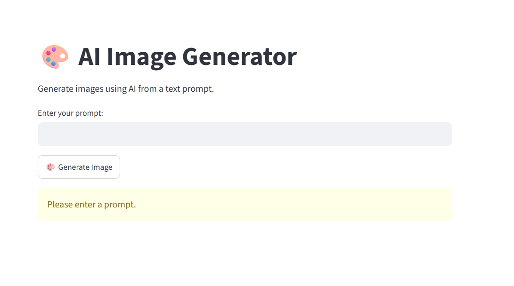
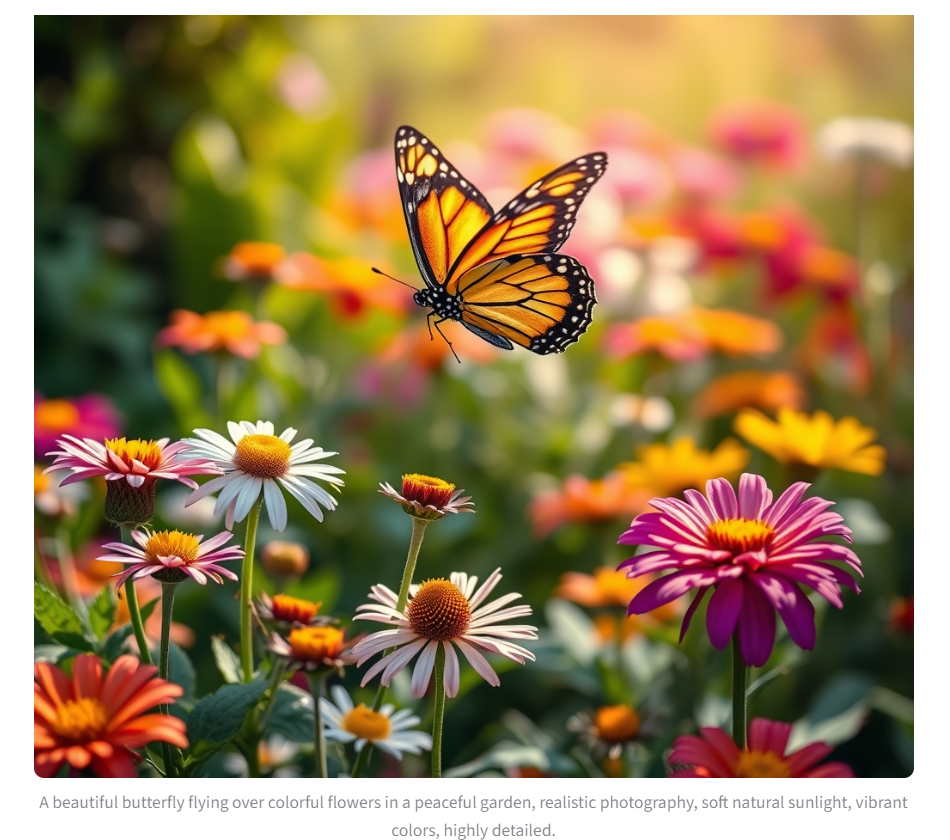
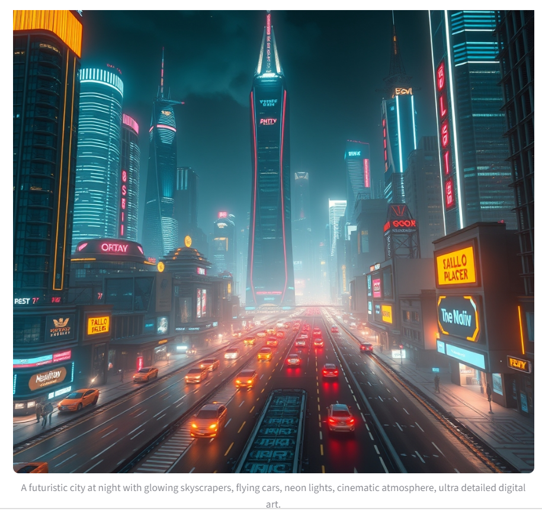

# 🎨 AI Image Generator

A simple AI-powered image generation application built with Python and Streamlit. The application converts text prompts into images using a Hugging Face image generation model.

## 📌 Project Overview

AI Image Generator allows users to enter a text description and generate a corresponding AI-generated image.

The application provides a simple and user-friendly interface for experimenting with text-to-image generation.

## 🎯 Objectives

- Generate images from text prompts
- Provide a simple and user-friendly Streamlit interface
- Use a Hugging Face AI image generation model
- Demonstrate practical Generative AI application development
- Explore text-to-image generation

## 🛠️ Tools & Technologies

- Python
- Streamlit
- Hugging Face
- Hugging Face Inference API
- Hugging Face Hub
- Diffusers

## 🚀 Live Demo

👉 **Live Demo:** Coming soon — Streamlit Community Cloud

## 🔄 Workflow

```text
User enters text prompt
        ↓
Streamlit Application
        ↓
Hugging Face Inference API
        ↓
AI Image Generation Model
        ↓
Generated Image
        ↓
Display Image
```

## 📚 Conclusion

The AI Image Generator demonstrates how Generative AI can be integrated into a simple Streamlit application to convert natural-language prompts into images.

This project provides practical experience with Python, Streamlit, Hugging Face APIs, AI models, and Generative AI application development.

## 📸 Screenshots

### 1. Main Interface

**Application Interface:**



### 2. Butterfly Output

**Prompt:**

> A beautiful butterfly flying over colorful flowers in a peaceful garden, realistic photography, soft natural sunlight, vibrant colors, highly detailed, cinematic composition.

**Generated Output:**



### 3. Futuristic City Output

**Prompt:**

> A futuristic city at night with glowing skyscrapers, flying cars, neon lights, cinematic atmosphere, ultra detailed digital art.

**Generated Output:**


